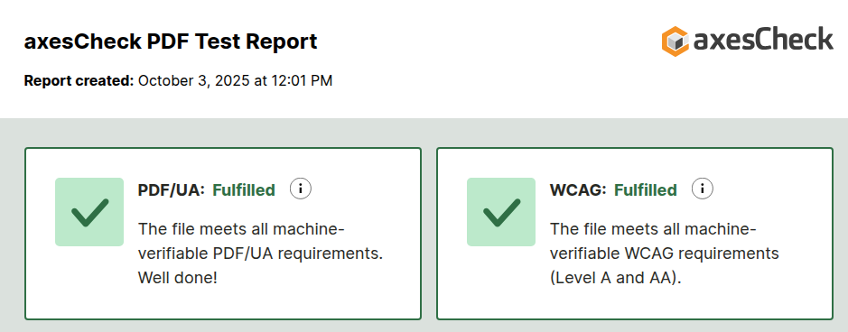

# venus-sample-pdf-fop-accessibility

This is a sample project configured using [fj-doc-maven-plugin init plugin](https://venusdocs.fugerit.org/guide/#maven-plugin-goal-init).

[](CHANGELOG.md)
[](https://sonarcloud.io/summary/new_code?id=fugerit79_venus-sample-pdf-fop-accessibility)
[](https://sonarcloud.io/summary/new_code?id=fugerit79_venus-sample-pdf-fop-accessibility)
[](https://opensource.org/licenses/MIT)
[](https://github.com/fugerit-org/fj-universe/blob/main/CODE_OF_CONDUCT.md)


## Requirement

* JDK 8+ (*)
* Maven 3.8+

(*) Currently FOP not working on [JDK 25, See bug JDK-8368356](https://bugs.openjdk.org/browse/JDK-8368356).

## Project initialization

This project was created with [Venus Maven plugin](https://venusdocs.fugerit.org/guide/#maven-plugin-goal-init)

```shell
mvn org.fugerit.java:fj-doc-maven-plugin:8.16.7:init \
-DgroupId=org.fugerit.java.demo \
-DartifactId=venus-sample-pdf-fop-accessibility \
-Dextensions=base,freemarker,mod-fop \
-Dflavour=vanilla
```

## PDF/A Type Handler

NOTE: PDF/A as nothing directly to do wit accessibility, 
we talk about it just for completeness and comparison.

To configure a PDF/A handler we need to embed fonts (in our case [TitilliumWeb](https://fonts.google.com/specimen/Titillium+Web/about))
and create the proper [fop-config-pdf-a.xml](src/main/resources/venus-sample-pdf-fop-accessibility/fop-config-pdf-a.xml) configuration.

Then we add the handler configuration (the [pdf-a-mode](https://venusdocs.fugerit.org/guide/#doc-handler-mod-fop-pdf-config-pdf-a-mode) attribute is needed) :

```xml
<docHandler id="pdf-fop-pdf-a" info="pdf" type="org.fugerit.java.doc.mod.fop.PdfFopTypeHandler">
    <docHandlerCustomConfig charset="UTF-8" fop-suppress-events="1" pdf-a-mode="PDF/A-1b"
                            fop-config-mode="classloader" fop-config-classloader-path="venus-sample-pdf-fop-accessibility/fop-config-pdf-a.xml" />
</docHandler>
```

## PDF/A size increase

NOTE: PDF/A profile usually increases the size of the output file.
(Because of font embedding and other features needed).

Let's see for instance the output on our [Unit Test](src/test/java/test/org/fugerit/java/demo/venussamplepdffopaccessibility/DocHelperTest.java),
As you can see, size for a simple PDF file increased by a factor of x10.

```
[main] INFO test.org.fugerit.java.demo.venussamplepdffopaccessibility.DocHelperTest - size document_pdf-fop-plain.pdf:7132
[main] INFO test.org.fugerit.java.demo.venussamplepdffopaccessibility.DocHelperTest - size document_pdf-fop-config.pdf:9809
[main] INFO test.org.fugerit.java.demo.venussamplepdffopaccessibility.DocHelperTest - size document_pdf-fop-pdf-a.pdf:73802
```

## PDF/UA Type Handler

For PDF/UA generation we need all the configuration set for PDF/A plus :

1. create the proper [fop-config-pdf-ua.xml](src/main/resources/venus-sample-pdf-fop-accessibility/fop-config-pdf-ua.xml) configuration.

2. add the handler configuration (the [pdf-ua-mode](https://venusdocs.fugerit.org/guide/#doc-handler-mod-fop-pdf-config-pdf-ua-mode) attribute is needed) :

```xml
<docHandler id="pdf-fop-pdf-ua" info="pdf" type="org.fugerit.java.doc.mod.fop.PdfFopTypeHandler">
    <docHandlerCustomConfig charset="UTF-8" fop-suppress-events="1" pdf-ua-mode="PDF/UA-1"
                            fop-config-mode="classloader" fop-config-classloader-path="venus-sample-pdf-fop-accessibility/fop-config-pdf-ua.xml" />
</docHandler>
```

3. In our [document](src/main/resources/venus-sample-pdf-fop-accessibility/fm-doc-process-config.xml) we already have some meta information need for accessibility, 
but be sure to set everything properly, for instance document meta information : 

```xml
        <info name="doc-title">${docTitle!defaultTitle}</info>
        <info name="doc-subject">fj doc venus sample source FreeMarker Template XML - ftlx</info>
        <info name="doc-author">fugerit79</info>
        <info name="doc-language">en</info>
```

NOTE: for better compatibility with PDF/UA profile we upgraded the PDF Version to 1.7 : 

```xml
	<renderers>
	   <renderer mime="application/pdf">
           <version>1.7</version>
           <!-- other configurations .... -->
       </renderer>
    </renderers>
```

Result checked with [axes4](https://check.axes4.com/) show full PDF/UA compliance for our output [document_pdf-fop-pdf-ua.pdf](https://check.axes4.com/en/result/c7a5270d-ec2e-4d8a-92c7-d5685c70ce47).



Here you can find the PDF generated for this test [document_pdf-fop-pdf-ua](src/main/docs/pdf-output/document_pdf-fop-pdf-ua.pdf).

Here is the final size check comparison : 

```
[main] INFO test.org.fugerit.java.demo.venussamplepdffopaccessibility.DocHelperTest - size document_fo-fop.fo:4813
[main] INFO test.org.fugerit.java.demo.venussamplepdffopaccessibility.DocHelperTest - size document_pdf-fop-plain.pdf:7132
[main] INFO test.org.fugerit.java.demo.venussamplepdffopaccessibility.DocHelperTest - size document_pdf-fop-config.pdf:9809
[main] INFO test.org.fugerit.java.demo.venussamplepdffopaccessibility.DocHelperTest - size document_pdf-fop-pdf-a.pdf:73802
[main] INFO test.org.fugerit.java.demo.venussamplepdffopaccessibility.DocHelperTest - size document_pdf-fop-pdf-ua.pdf:70860
```

## Images in PDF File

Now we try to add an image to our PDF : [check-ok-no-transparency.jpg](src/main/docs/images/check-ok-no-transparency.jpg) : 

```
    <#if (checkImageBase64)??><image alt="Check with AXES 4" type="png" base64="${checkImageBase64}"/></#if>
```

```java
byte[] data = FileIO.readBytes( "src/main/docs/images/check-ok-no-transparency.jpg" );
String imageBase64 = Base64.getEncoder().encodeToString( data );
// code ...
docHelper.getDocProcessConfig().fullProcess( chainId, DocProcessContext.newContext( "listPeople", listPeople )
    .withAtt( "checkImageBase64", imageBase64 ), // we add the base 64 of the image
    handlerId, fos );
```

Here is a new size comparison : 

```
[main] INFO test.org.fugerit.java.demo.venussamplepdffopaccessibility.DocHelperTest - size document_fo-fop.fo:51655
[main] INFO test.org.fugerit.java.demo.venussamplepdffopaccessibility.DocHelperTest - size document_pdf-fop-plain.pdf:42393
[main] INFO test.org.fugerit.java.demo.venussamplepdffopaccessibility.DocHelperTest - size document_pdf-fop-config.pdf:45317
[main] INFO test.org.fugerit.java.demo.venussamplepdffopaccessibility.DocHelperTest - size document_pdf-fop-pdf-a.pdf:109312
[main] INFO test.org.fugerit.java.demo.venussamplepdffopaccessibility.DocHelperTest - size document_pdf-fop-pdf-ua.pdf:106166
```

NOTE: for images and other elements you must follow your active profiles rules, for instance images with transparency are not supported in PDF/A-1b and would lead to an error like :

```
Caused by: org.apache.fop.pdf.TransparencyDisallowedException: PDF/A-1b does not allow the use of transparency
```

## PDF/UA with no font embedding

Technically font embedding is not mandatory for PDF/UA but is 
highly [advised](https://docs.oracle.com/cd/F28172_01/AG/Content/Accessibility%20Guide/AccessiblePDFs.htm)
to preserve document layout.

We have created an additional type handler with no font embedded [fop-config-pdf-ua-no-font-embedding.xml](src/main/resources/venus-sample-pdf-fop-accessibility/fop-config-pdf-ua-no-font-embedding.xml).

The resulting PDF's size is much smaller : 

```
[main] INFO test.org.fugerit.java.demo.venussamplepdffopaccessibility.DocHelperTest - size document_fo-fop.fo:51655
[main] INFO test.org.fugerit.java.demo.venussamplepdffopaccessibility.DocHelperTest - size document_pdf-fop-plain.pdf:42710
[main] INFO test.org.fugerit.java.demo.venussamplepdffopaccessibility.DocHelperTest - size document_pdf-fop-config.pdf:45633
[main] INFO test.org.fugerit.java.demo.venussamplepdffopaccessibility.DocHelperTest - size document_pdf-fop-pdf-a.pdf:109708
[main] INFO test.org.fugerit.java.demo.venussamplepdffopaccessibility.DocHelperTest - size document_pdf-fop-pdf-ua.pdf:106513
[main] INFO test.org.fugerit.java.demo.venussamplepdffopaccessibility.DocHelperTest - size document_pdf-fop-pdf-ua-no-font-embedding.pdf:49463
```